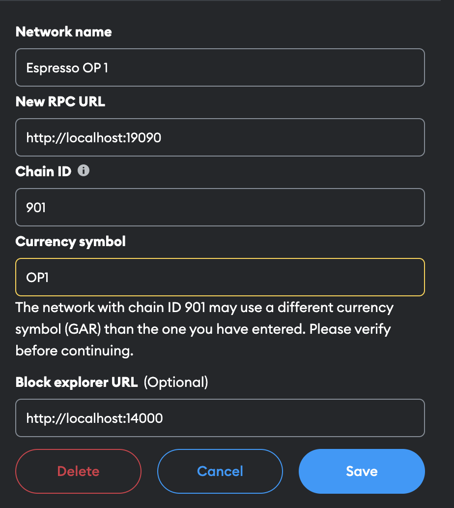
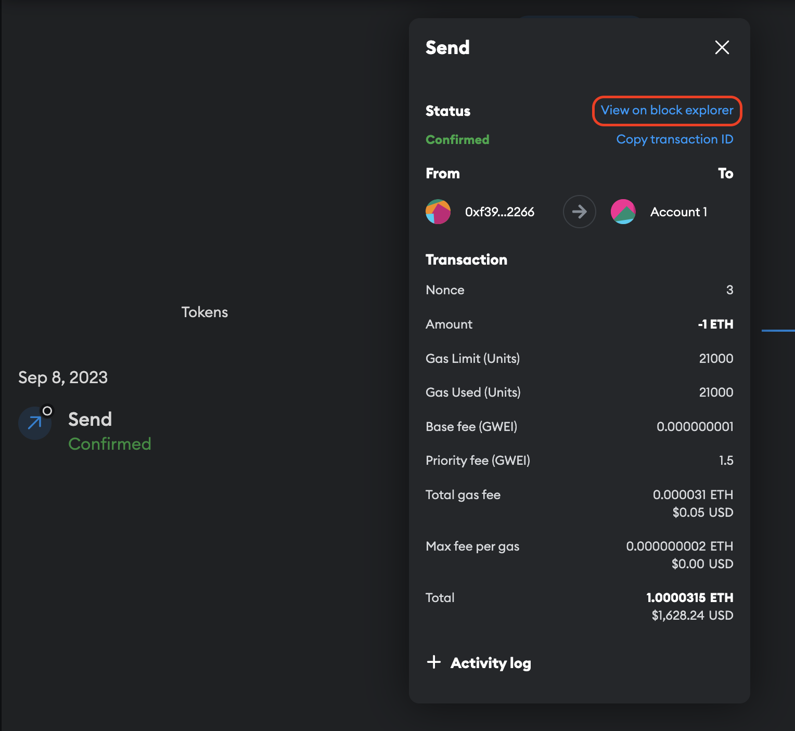

# Optimism

<div align="center">
  <br />
  <br />
  <a href="https://optimism.io"></a>
  <br />
  <h3><a href="https://optimism.io">Optimism</a> is Ethereum, scaled.</h3>
  <br />
</div>

<div align="center">
  <br />
  <br />
  <a href="https://espressosys.com"></a>
  <br />
</div>

This repo is a fork for [ethereum-optimism/optimism](https://github.com/ethereum-optimism/optimism), in which the Espresso Systems team has integrated the Espresso Sequencer as an option for decentralized sequencing of OP Stack rollups. To learn more about the integration, read [our documentation](https://docs.espressosys.com/sequencer/releases/cortado-testnet-release/op-stack-integration). To try it out for yourself, follow [the instructions below](#running-the-local-devnet).

## What is Optimism?

[Optimism](https://www.optimism.io/) is a project dedicated to scaling Ethereum's technology and expanding its ability to coordinate people from across the world to build effective decentralized economies and governance systems. The [Optimism Collective](https://app.optimism.io/announcement) builds open-source software for running L2 blockchains and aims to address key governance and economic challenges in the wider cryptocurrency ecosystem. Optimism operates on the principle of **impact=profit**, the idea that individuals who positively impact the Collective should be proportionally rewarded with profit. **Change the incentives and you change the world.**

In this repository, you'll find numerous core components of the OP Stack, the decentralized software stack maintained by the Optimism Collective that powers Optimism and forms the backbone of blockchains like [OP Mainnet](https://explorer.optimism.io/) and [Base](https://base.org). Designed to be "aggressively open source," the OP Stack encourages you to explore, modify, extend, and test the code as needed. Although not all elements of the OP Stack are contained here, many of its essential components can be found within this repository. By collaborating on free, open software and shared standards, the Optimism Collective aims to prevent siloed software development and rapidly accelerate the development of the Ethereum ecosystem. Come contribute, build the future, and redefine power, together.

## What is the Espresso Sequencer?

[Espresso](https://espressosys.com) helps rollups scale, decentralize, and interoperate.

The [Espresso Sequencer](https://github.com/EspressoSystems/espresso-sequencer) offers rollups credible neutrality and enhanced interoperability, without compromising on scale. Consisting of a data availability solution and a decentralized network of nodes that sequences transactions, layer-2 rollups can leverage the Espresso Sequencer to give developers and end users fast confirmations, low (and fair) fees, and robust infrastructure.

## Running the local devnet

1. Install nix if it’s not installed yet: https://nixos.org/download
   1. On OSX run `sh <(curl -L https://nixos.org/nix/install)`
   2. On Linux run `sh <(curl -L https://nixos.org/nix/install) --daemon`
2. If docker is not yet installed or running, install docker and start it

   1. On OSX: If you already have [docker desktop](https://docs.docker.com/desktop/install/mac-install/) installed and running you can keep using docker desktop and skip this step. Otherwise the quickest way to get docker is:

      ```bash
      brew update
      brew install colima docker docker-compose
      # The number of CPUs and GBs of RAM will be reserved for running the demo
      # If you have RAM to spare consider using 4 or 8 GB instead.
      colima start --cpu 4 --memory 2 --vm-type=vz
      ```

   2. On Linux follow for example the instructions here: https://docs.docker.com/engine/install/

3. Download the demo source code

   ```bash
   # Takes about 1 minute
   git clone --recursive https://github.com/EspressoSystems/op-espresso-integration
   ```

4. Run the demo

   ```bash
   cd op-espresso-integration
   git pull

   # Activate the development env
   # Takes about 1.5 minutes the first time (with fast network connection),
   # Should only take a few seconds when activated again afterwards.
   # All the `make` commands below need to be run in a terminal where the
   # nix-shell is activated.
   nix-shell

   # Setup the repo
   # Takes about 2 minutes the first time
   make

   # Takes about 1 minute, **only needs to be run once**
   make cannon-prestate

   # Build and launch the first rollup, L1, and sequencer
   # Takes about 5 minutes the first time.
   make devnet-up-espresso

   # After that finishes to deploy the second rollup on the existing L1 and sequencer
   make devnet-up-espresso2

   # To run tests to check if it's working (these must be run in serial, since both tests make use
   # of the same L1 account).
   make devnet-test-espresso
   make devnet-test-espresso2

   # To stop the demo
   make devnet-clean
   ```

5. Navigate to [http://localhost:14000](http://localhost:4000) to see the block explorer. If you started the second rollup, its block explorer can be found at http://localhost:24000. If the bock explorers are successfully syncing, a new block appears every few seconds.
6. Setup metamask

   <aside>
   💡 If the demo is restarted metamask nonces need to be reset: Settings → Advanced → Clear activity tab data

   </aside>

   1. Open chrome (other chrome based browsers such as chromium, brave; firefox should work too).
   2. [optional, but suggested] create a new browser profile
   3. Add the [metamask extension](https://chrome.google.com/webstore/detail/metamask/nkbihfbeogaeaoehlefnkodbefgpgknn)
   4. One the “Let’s get started page” Click “Import an existing wallet”

      1. Restore from mnemonic

         ```bash
         test test test test test test test test test test test junk
         ```

         The whole mnemonic can be copy pasted at once by pasting it into the field of the first word.

      2. As the mnemonic is not secret, feel free to use a dummy password such as 12341234.

   5. Connect metamask to the L2s. Custom networks needs to be added for each of the OP rollups.
      - In metamask, go to `Settings -> Networks -> Add a network -> Add a network manually`
        | Parameter | Value for OP node 1 | Value for OP node 2 | Notes |
        | --------------- | ---------------------- | ---------------------- | ---------------------------------------------------------------------------------------------- |
        | Network name | Espresso OP 1 | Espresso OP 2 | Set as desired |
        | RPC URL | http://localhost:19090 | http://localhost:29090 | |
        | Chain ID | 901 | 902 | |
        | Currency Symbol | OP1 | OP2 | For display purposes only. It can be chosen freely, but note this will show in the metamask UI |
        | Block explorer | http://localhost:14000 | http://localhost:24000 | |
      - Your settings should look something like this:

        
      - Note that metamask won’t let one save this custom network if the demo is not running.
   6. Use metamask as usual to send ETH
   7. When a transaction is confirmed in your MetaMask Activity tab, you can click on it and click “View on block explorer” to see the transaction.

      

   8. To add the ERC20 token click on "Tokens" -> "Import tokens" and paste the
      address `0xfbfbfDdd6e35dA57b7B0F9a2C10E34Be70B3A4E9`. The address is the
      same for both L2s. To mint tokens, send ether to this contract addresses.

## Documentation

- If you want to build on top of OP Mainnet, refer to the [Optimism Community Hub](https://community.optimism.io)
- If you want to build your own OP Stack based blockchain, refer to the [OP Stack docs](https://stack.optimism.io)
- If you want to contribute to the OP Stack, check out the [Protocol Specs](./specs)

## Community

General discussion happens most frequently on the [Optimism discord](https://discord.gg/optimism).
Governance discussion can also be found on the [Optimism Governance Forum](https://gov.optimism.io/).

## Contributing

Read through [CONTRIBUTING.md](./CONTRIBUTING.md) for a general overview of the contributing process for this repository.
Use the [Developer Quick Start](./CONTRIBUTING.md#development-quick-start) to get your development environment set up to start working on the Optimism Monorepo.
Then check out the list of [Good First Issues](https://github.com/ethereum-optimism/optimism/contribute) to find something fun to work on!

## Security Policy and Vulnerability Reporting

Please refer to the canonical [Security Policy](https://github.com/ethereum-optimism/.github/blob/master/SECURITY.md) document for detailed information about how to report vulnerabilities in this codebase.
Bounty hunters are encouraged to check out [the Optimism Immunefi bug bounty program](https://immunefi.com/bounty/optimism/).
The Optimism Immunefi program offers up to $2,000,042 for in-scope critical vulnerabilities.

## The Bedrock Upgrade

OP Mainnet is currently preparing for [its next major upgrade, Bedrock](https://dev.optimism.io/introducing-optimism-bedrock/).
You can find detailed specifications for the Bedrock upgrade within the [specs folder](./specs) in this repository.

Please note that a significant number of packages and folders within this repository are part of the Bedrock upgrade and are NOT currently running in production.
Refer to the Directory Structure section below to understand which packages are currently running in production and which are intended for use as part of the Bedrock upgrade.

## Directory Structure

<pre>
├── <a href="./docs">docs</a>: A collection of documents including audits and post-mortems
├── <a href="./op-bindings">op-bindings</a>: Go bindings for Bedrock smart contracts.
├── <a href="./op-batcher">op-batcher</a>: L2-Batch Submitter, submits bundles of batches to L1
├── <a href="./op-bootnode">op-bootnode</a>: Standalone op-node discovery bootnode
├── <a href="./op-chain-ops">op-chain-ops</a>: State surgery utilities
├── <a href="./op-challenger">op-challenger</a>: Dispute game challenge agent
├── <a href="./op-e2e">op-e2e</a>: End-to-End testing of all bedrock components in Go
├── <a href="./op-exporter">op-exporter</a>: Prometheus exporter client
├── <a href="./op-heartbeat">op-heartbeat</a>: Heartbeat monitor service
├── <a href="./op-node">op-node</a>: rollup consensus-layer client
├── <a href="./op-preimage">op-preimage</a>: Go bindings for Preimage Oracle
├── <a href="./op-program">op-program</a>: Fault proof program
├── <a href="./op-proposer">op-proposer</a>: L2-Output Submitter, submits proposals to L1
├── <a href="./op-service">op-service</a>: Common codebase utilities
├── <a href="./op-signer">op-signer</a>: Client signer
├── <a href="./op-wheel">op-wheel</a>: Database utilities
├── <a href="./ops-bedrock">ops-bedrock</a>: Bedrock devnet work
├── <a href="./packages">packages</a>
│   ├── <a href="./packages/chain-mon">chain-mon</a>: Chain monitoring services
│   ├── <a href="./packages/common-ts">common-ts</a>: Common tools for building apps in TypeScript
│   ├── <a href="./packages/contracts-ts">contracts-ts</a>: ABI and Address constants
│   ├── <a href="./packages/contracts-bedrock">contracts-bedrock</a>: Bedrock smart contracts
│   ├── <a href="./packages/core-utils">core-utils</a>: Low-level utilities that make building Optimism easier
│   └── <a href="./packages/sdk">sdk</a>: provides a set of tools for interacting with Optimism
├── <a href="./proxyd">proxyd</a>: Configurable RPC request router and proxy
└── <a href="./specs">specs</a>: Specs of the rollup starting at the Bedrock upgrade
</pre>

## Branching Model

### Active Branches

| Branch          | Status                                                                           |
| --------------- | -------------------------------------------------------------------------------- |
| [master](https://github.com/ethereum-optimism/optimism/tree/master/)                   | Accepts PRs from `develop` when intending to deploy to production.                  |
| [develop](https://github.com/ethereum-optimism/optimism/tree/develop/)                 | Accepts PRs that are compatible with `master` OR from `release/X.X.X` branches.                    |
| release/X.X.X                                                                          | Accepts PRs for all changes, particularly those not backwards compatible with `develop` and `master`. |

### Overview

This repository generally follows [this Git branching model](https://nvie.com/posts/a-successful-git-branching-model/).
Please read the linked post if you're planning to make frequent PRs into this repository.

### Production branch

The production branch is `master`.
The `master` branch contains the code for latest "stable" releases.
Updates from `master` **always** come from the `develop` branch.

### Development branch

The primary development branch is [`develop`](https://github.com/ethereum-optimism/optimism/tree/develop/).
`develop` contains the most up-to-date software that remains backwards compatible with the latest experimental [network deployments](https://community.optimism.io/docs/useful-tools/networks/).
If you're making a backwards compatible change, please direct your pull request towards `develop`.

**Changes to contracts within `packages/contracts-bedrock/src` are usually NOT considered backwards compatible and SHOULD be made against a release candidate branch**.
Some exceptions to this rule exist for cases in which we absolutely must deploy some new contract after a release candidate branch has already been fully deployed.
If you're changing or adding a contract and you're unsure about which branch to make a PR into, default to using the latest release candidate branch.
See below for info about release candidate branches.

### Release candidate branches

Branches marked `release/X.X.X` are **release candidate branches**.
Changes that are not backwards compatible and all changes to contracts within `packages/contracts-bedrock/src` MUST be directed towards a release candidate branch.
Release candidates are merged into `develop` and then into `master` once they've been fully deployed.
We may sometimes have more than one active `release/X.X.X` branch if we're in the middle of a deployment.
See table in the **Active Branches** section above to find the right branch to target.

## Releases

### Changesets

We use [changesets](https://github.com/changesets/changesets) to mark packages for new releases.
When merging commits to the `develop` branch you MUST include a changeset file if your change would require that a new version of a package be released.

To add a changeset, run the command `pnpm changeset` in the root of this monorepo.
You will be presented with a small prompt to select the packages to be released, the scope of the release (major, minor, or patch), and the reason for the release.
Comments within changeset files will be automatically included in the changelog of the package.

### Triggering Releases

Releases can be triggered using the following process:

1. Create a PR that merges the `develop` branch into the `master` branch.
2. Wait for the auto-generated `Version Packages` PR to be opened (may take several minutes).
3. Change the base branch of the auto-generated `Version Packages` PR from `master` to `develop` and merge into `develop`.
4. Create a second PR to merge the `develop` branch into the `master` branch.

After merging the second PR into the `master` branch, packages will be automatically released to their respective locations according to the set of changeset files in the `develop` branch at the start of the process.
Please carry this process out exactly as listed to avoid `develop` and `master` falling out of sync.

**NOTE**: PRs containing changeset files merged into `develop` during the release process can cause issues with changesets that can require manual intervention to fix.
It's strongly recommended to avoid merging PRs into develop during an active release.

## License

All other files within this repository are licensed under the [MIT License](https://github.com/ethereum-optimism/optimism/blob/master/LICENSE) unless stated otherwise.
